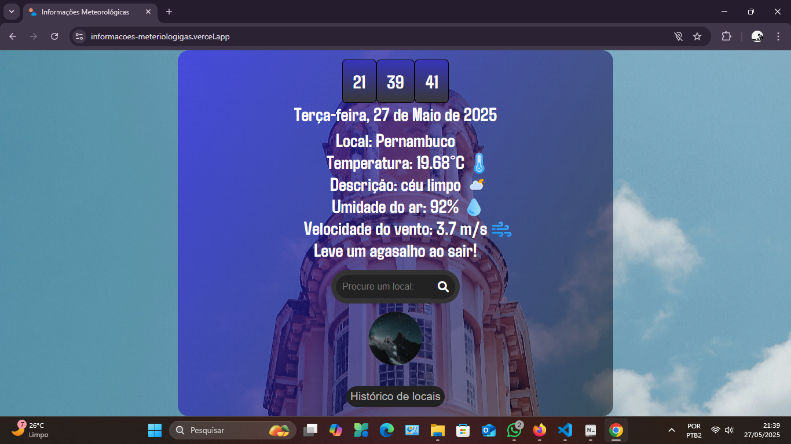
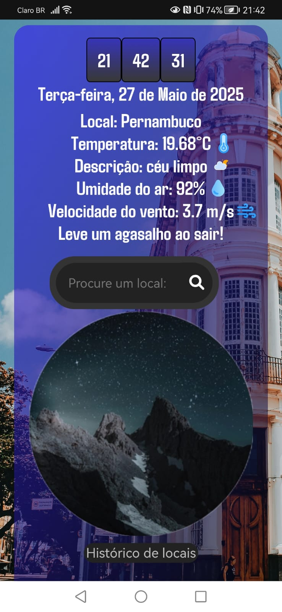

# 🌤️ Informações Meteorológicas em Tempo Real

Este é um projeto desenvolvido em **HTML + CSS + TypeScript**, hospedado na **Vercel**, que fornece informações meteorológicas em tempo real.  
Além de exibir a previsão do tempo atual de acordo com a localização do usuário, o app oferece **temas dinâmicos (Manhã, Tarde e Noite)** e uma interface totalmente **responsiva e interativa**.

---

## 📌 Funcionalidades

- ✅ Exibição do clima atual com dados detalhados
- ✅ Detecção automática da localização do usuário com geolocalização
- ✅ Pesquisa de clima por qualquer cidade do mundo
- ✅ Alteração do tema do site (manhã, tarde ou noite) baseada no horário
- ✅ Histórico de buscas com exibição opcional
- ✅ Design responsivo e adaptável (Mobile, Tablet e Desktop)
- ✅ Estilização moderna e acessível
- ✅ Deploy completo na Vercel

---

## 🧪 Tecnologias Utilizadas

| Ferramenta | Descrição |
|------------|-----------|
| [HTML5](https://developer.mozilla.org/pt-BR/docs/Web/HTML) | Estruturação semântica da página |
| [CSS3](https://developer.mozilla.org/pt-BR/docs/Web/CSS) | Estilização responsiva e dinâmica |
| [TypeScript](https://www.typescriptlang.org/) | Lógica e manipulação de dados meteorológicos |
| [API Meteorológica](https://openweathermap.org/) | Obtenção de dados em tempo real |
| [Vercel](https://vercel.com/) | Plataforma de deploy automatizado |

---

## 🖼️ Layout

> 💻 Desktop | 📱 Mobile

| Desktop             | Mobile              |
|---------------------|---------------------|
<div align="center">
  
  
</div>

---

## 🔄 Temas Dinâmicos

O site muda automaticamente seu tema visual com base no horário do dia:

| Horário | Tema |
|---------|------|
| Manhã   | 🌅 Cores claras e suaves |
| Tarde   | 🌞 Cores vibrantes e intensas |
| Noite   | 🌙 Cores escuras e relaxantes |

---

## 📦 Instalação Local

```
# Clone o repositório
git clone https://github.com/seu-usuario/informacoes-meteorologicas.git
cd informacoes-meteorologicas

# (Opcional) Instale dependências do TypeScript
npm install

# Execute localmente
# Abra o arquivo index.html no navegador ou use um servidor local
```

---

## 🔒 Validação de Entradas

- Suporte a pesquisa de qualquer cidade do mundo.
- Exibição clara de mensagens de erro caso a cidade não seja encontrada.
- Uso de geolocalização para definir cidade inicial (caso o usuário permita).

---

## 🧹 Histórico de Buscas

- Cada busca é salva no histórico, exibindo:
  - Cidade pesquisada
  - Temperatura atual
  - Condições do tempo
- Botão para limpar o histórico.

---

## 🌐 Deploy na Vercel

[](https://informacoes-meteriologigas.vercel.app/)

---

## 🤝 Contribuições

Contribuições são sempre bem-vindas!  
Se você tiver ideias para melhorar o projeto ou identificar bugs, sinta-se à vontade para abrir uma issue ou pull request.

---

## 👨‍💻 Autor

Desenvolvido por: **Anathyon Erysson**  
📫 anathyonerysson@protonmail.com  
🔗 [LinkedIn](https://www.linkedin.com/in/anathyonerysson/)

